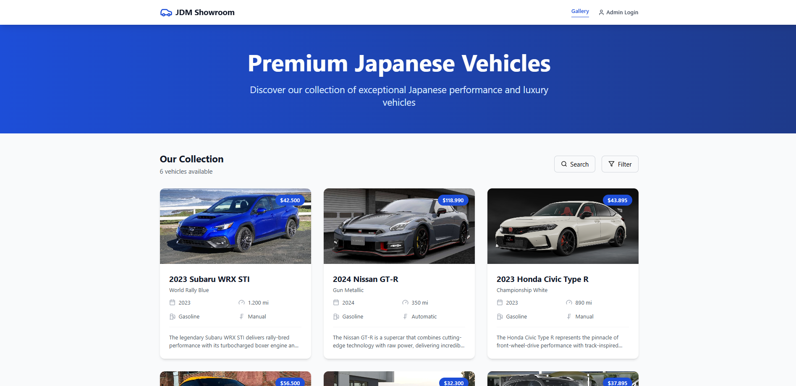
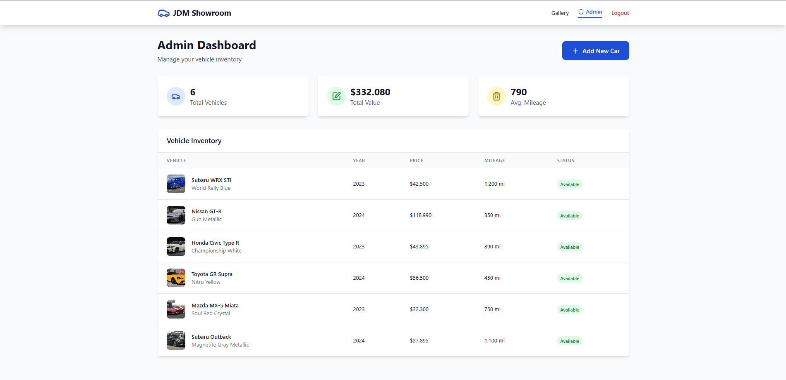
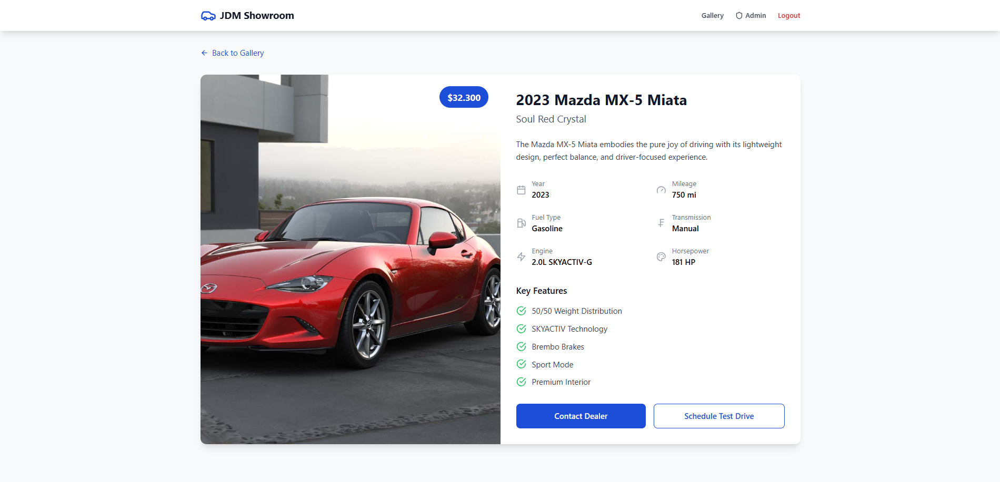

# Car Showroom

Bu proje, **araba satışları için bir showroom uygulaması** olarak geliştirilmiştir.  
Kullanıcılar, mevcut arabaları görüntüleyebilir ve detaylı bilgilerini inceleyebilirler.

---

## 🚀 Başlangıç

### 📥 Projeyi Klonlama

Projeyi bilgisayarınıza klonlamak için aşağıdaki komutu kullanabilirsiniz:

```bash
git clone https://github.com/Kerimcan19/Car-Showroom.git
```
---
⚙️ Kurulum

Projeyi kurmak için aşağıdaki adımları izleyin:

Gerekli bağımlılıkları yüklemek için:
```bash
npm install
```

Projeyi başlatmak için:
```bash
npm run dev
```
Bu adımlar, projeyi yerel geliştirme ortamınızda çalıştıracaktır.

---
🛠️ Kullanılan Teknolojiler

Frontend: TypeScript, Tailwind CSS, Vite

Backend: FastAPI

Veritabanı: PostgreSQL

---

📸 Ekran Görüntüleri



